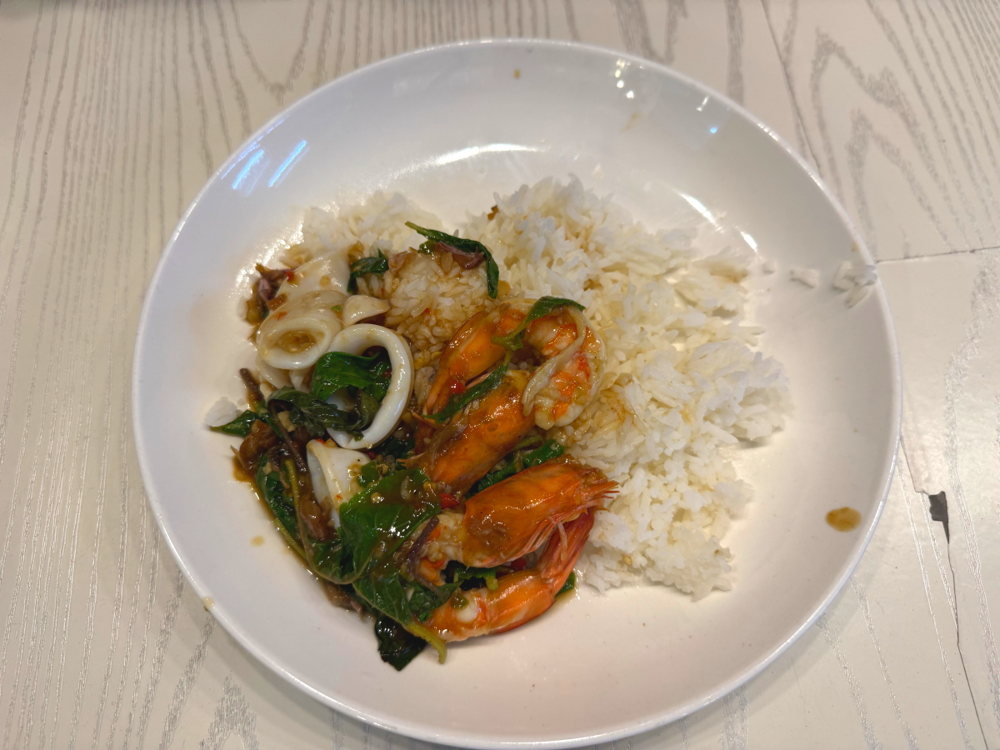

# 20250807_bangkok

<html lang="ja" data-loaded="false" data-scrolled="false" data-spmenu="closed">

<head>

<meta charset="UTF-8">
<meta http-equiv="Content-Type" content="text/html; charset=UTF-8">
<meta http-equiv="X-UA-Compatible" content="IE=EmulateIE10" />
<meta http-equiv="X-UA-Compatible" content="IE=edge">

<meta name="viewport" content="width=device-width, initial-scale=1.0">

<!--ここから上はお決まりの定型文です-->

<!--ここからが表現の書式などを決めるcssという部分-->

<link href="https://cdnjs.cloudflare.com/ajax/libs/lightbox2/2.7.1/css/lightbox.css" rel="stylesheet">

</head>

<body>

モバイル端末をお使いの場合は、画面を横向きにすると
より見やすくご覧頂けます。

<!--ここ上は、ほぼそのまま使います！-->

<!--QRコードの挿入例-->

 アクセス用QRコード

<marquee direction="left" scrollamount="20" width="30%">(^_^)/~alis</marquee>

<!--流れ文字の挿入例-->
<h1><marquee behavior="left">!!! 2025/08/05-06、市内のローカル市場から、コンビニ横の屋台、最後は四国松山の道後温泉まで!!!</marquee></h1>

                          

<!--ここから下が、本体部分-->
    

 
<h2>5日、近場の市場まで行きました。駐車場は満車でお兄さんが車誘導・駐車整理</h2>

    
<h2>市場は大盛況</h2>

    
<h2>寄付を募る盲人の女性</h2>

    
<h2>果物の販売量は、一回では食べられないレベル</h2>

    
<h2>とうもろこしは実の部分をナイフで剥がして販売されてました</h2>

    
<h2>横断歩道なしの４車線道路を渡るのに、中央部分で待つ女性</h2>

    
<h2>お店の下には餌を待つ犬</h2>

    
<h2>こんな自販機もありました</h2>

<h2>元気そうなお兄さんの購入品を参考に、同じものを買いました</h2>

    
<h2>人が集まるところに必ずある宝くじ売り場</h2>

    
<h2>猫ちゃん、餌をもらいました</h2>

    
<h2>市場の購入品で晩御飯</h2>

    
<h2>6日も近場を散策します</h2>

<h2>信号なし交差点での右折は前車にぴったりくっついて行くしかありません 画像クリックで動画再生します↓</h2>

    
<h2>スーパーよりちょっと高めのブランドパン屋さんで、翌朝の朝ごはんを購入</h2>

    
<h2>晩御飯はいつものコンビニ横屋台で</h2>

    
<h2>チャーハンを掘り起こすと、大きなエビが3つ出てきました</h2>

    
<h2>朝8時から夜の9時まで営業の屋台</h2>

   

<h2>約4000km離れた四国松山から、無線つながりのメンバーが温泉情報を送ってくれました この距離を感じさせない通信事情の進化に感謝ですね</h2>

    
<h2>道後温泉のからくり時計</h2>

<iframe width="560" height="315" src="https://www.youtube.com/embed/hdrirJFJIgk?si=8Ydl1ppJ3d6kYV-B" title="YouTube video player" frameborder="0" allow="accelerometer; autoplay; clipboard-write; encrypted-media; gyroscope; picture-in-picture; web-share" referrerpolicy="strict-origin-when-cross-origin" allowfullscreen></iframe>
    

<h2>道後アーケードと路面電車</h2>

<iframe width="560" height="315" src="https://www.youtube.com/embed/awGPJHDp_uA?si=Vyb-BzHI7ZLlsKYT" title="YouTube video player" frameborder="0" allow="accelerometer; autoplay; clipboard-write; encrypted-media; gyroscope; picture-in-picture; web-share" referrerpolicy="strict-origin-when-cross-origin" allowfullscreen></iframe>
    

    
<h2>道後温泉の画像集</h2>

<h2>精緻な木彫りの前では小五のお孫さんがこんにちは！</h2>

         

<!--  
<h2>再掲【暑中お見舞い（ほたる）】LINEでご挨拶・動画で送る夏のグリーティングカード / ギターbgm/蛍の光・癒し動画</h2>

<iframe width="560" height="315" src="https://www.youtube.com/embed/Z4PKDOhRzfI?si=LaAJ8dA-1izGspEO" title="YouTube video player" frameborder="0" allow="accelerometer; autoplay; clipboard-write; encrypted-media; gyroscope; picture-in-picture; web-share" referrerpolicy="strict-origin-when-cross-origin" allowfullscreen></iframe>
    
   
-->   
    
    

  
<h2>今日のBGMは Michael Bolton, Elton John, Phil Collins, Rod Stewart, Bee Gees 📀 Soft Rock Love Songs 70s 80s 90s</h2>

<iframe width="560" height="315" src="https://www.youtube.com/embed/jWJbS-wAKT0?si=x-QWDzxgxA2_8rMv" title="YouTube video player" frameborder="0" allow="accelerometer; autoplay; clipboard-write; encrypted-media; gyroscope; picture-in-picture; web-share" referrerpolicy="strict-origin-when-cross-origin" allowfullscreen></iframe>
    

    
  
<h2>もう一つ、7月11日にメタバースで披露されたまいてゃさんの新曲 ちょっと音量小さめなのでボリュームあげて下さい</h2>

<iframe src="https://www.youtube.com/embed/K3CuXhdeKlY?si=yPW9XjXo5Hi18oeY" title="YouTube video player" frameborder="0" allow="accelerometer; autoplay; clipboard-write; encrypted-media; gyroscope; picture-in-picture; web-share" referrerpolicy="strict-origin-when-cross-origin" allowfullscreen></iframe>
    

    
    

    
    
    <h3>「雪の中で輝くシンデレラ」by まいてゃ</h3>
<h2><a href="https://torokoid.github.io/20250219_chiangrai/maitiyaz.mp3" target="_blank">この文字クリックで再生します 下の再生ボタンでも同じ曲をループ再生します</a></h2>

    <audio controls loop>
        <source src="https://torokoid.github.io/20250219_chiangrai/maitiyaz.mp3" type="audio/mpeg">
        お使いのブラウザは audio タグをサポートしていません。
    </audio>
 
    
<!--
  
<h2>スティーブ・ジョブズの伝説の講義</h2> 
<iframe width="560" height="315" src="https://www.youtube.com/embed/XsRpvWHIVw0?si=f7IA0pv9iZWVk3VH" title="YouTube video player" frameborder="0" allow="accelerometer; autoplay; clipboard-write; encrypted-media; gyroscope; picture-in-picture; web-share" referrerpolicy="strict-origin-when-cross-origin" allowfullscreen></iframe>    
    
    
<h2>スティーブ・ジョブズ氏の講義の内容が「笑って死ぬ」by まいてゃ さんの歌の内容と大筋で同じに聞こえます 以下に再掲しますね</h2>

    
<h3>歌の後半部分しか撮れてませんが、2月16日のイベントで公開された「笑って死ぬ」 by まいてゃ 白ドレスはダンサーの玖遠さん、黒いドレスがまいてゃさん</h3>
<iframe width="560" height="315" src="https://www.youtube.com/embed/s4ZcbxAluMM?si=Xa32xo19UCNaWv0v" title="YouTube video player" frameborder="0" allow="accelerometer; autoplay; clipboard-write; encrypted-media; gyroscope; picture-in-picture; web-share" referrerpolicy="strict-origin-when-cross-origin" allowfullscreen></iframe> 
-->
    

    <h3>お気に入りの「笑って死ぬ」 by まいてゃさんも再々掲です</h3>
<h2><a href="https://torokoid.github.io/20250221_chiangrai/maitiya3.mp3" target="_blank">この文字クリックで再生します 下の再生ボタンで同じ曲をループ再生します</a></h2>

    <audio controls loop>
        <source src="https://torokoid.github.io/20250221_chiangrai/maitiya3.mp3" type="audio/mpeg">
        お使いのブラウザは audio タグをサポートしていません。
    </audio>

   
<h2>以上、パンコクのローカル市場から、コンビニ横の屋台、最後は四国松山の道後温泉まででした。 ここまでご覧いただきありがとうございました。</h2>

     
<h2>
<a href="https://torokoid.github.io/Mashiko_himawari_3/" target="_blank">クリックでメニューページに戻ります</a>
</h2>

   

あなたは  番目の訪問者です

  

         

  

      

<!--本体はここまで-->

<!--画面に空白地帯を作って、背景が見えるようにしています-->
                                              

<!-- フッタ -->
<footer>

Copyright 2025/08/07 alis @Bangkok

</footer>

<!--HPにさまざまなJavaScriptを呼び込むための書式-->

    
    </body>
    
</html>
